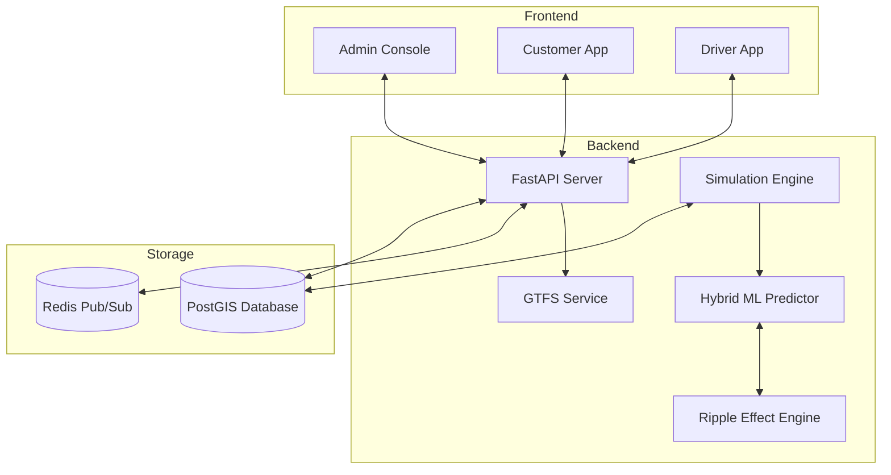
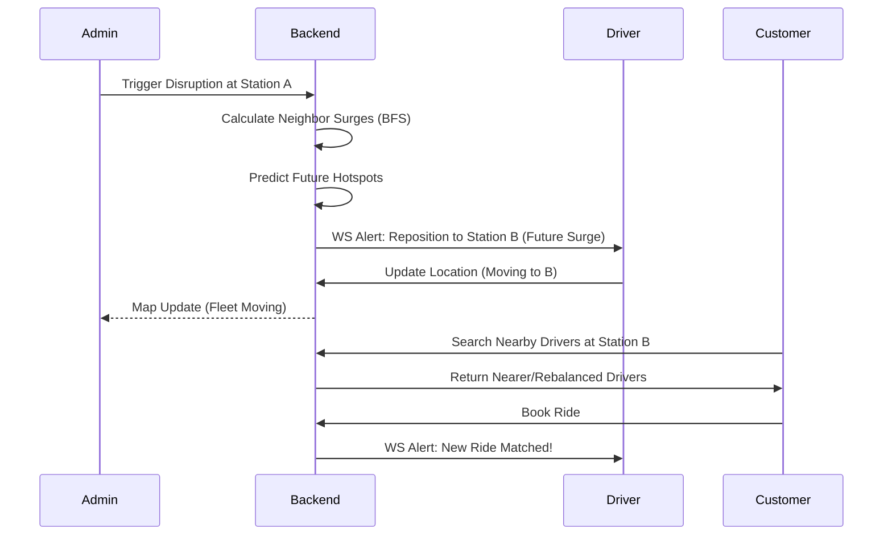

# TransitSync: Predictive Last-Mile Transit Synchronization 🚇⚡

By **TechWizard Team** (LucidStack-code)

**TransitSync** is a data-driven operational platform designed to solve the "Last-Mile Problem" by synchronizing micro-mobility fleets with real-time transit schedules and network disruptions.

---

## 📋 Table of Contents
1. [Introduction](#-introduction)
2. [The Two Simulation Twists](#-the-two-simulation-twists)
3. [User Experience Roles](#-user-experience-roles)
    - [Admin Command Center](#admin-command-center)
    - [Driver Partner App](#driver-partner-app)
    - [Customer Booking](#customer-booking)
4. [System Architecture](#-system-architecture)
5. [Operational Workflow](#-operational-workflow)
6. [Database Schema](#-database-schema)
7. [Tech Stack](#-tech-stack)
8. [Installation & Setup](#-installation--setup)
9. [Interactive Demo Guide](#-interactive-demo-guide)
10. [Project Structure](#-project-structure)
11. [Future Roadmap](#-future-roadmap)

---

## 🚀 Introduction

### The Problem
Public transit networks are highly volatile. A breakdown at one station creates a **Ripple Effect**, where stranded passengers spill over to neighboring stations, causing unpredictable demand surges 30–60 minutes later. Meanwhile, e-bike fleets often fail because they run out of battery during these peaks.

### The TransitSync Solution
We provide a tri-lateral platform (Admin, Driver, Customer) that uses machine learning to predict these ripples and proactively reposition an **autonomous, battery-aware fleet** to meet the coming surge.

---

## 🌀 The Two Simulation Twists

### 1. Ripple Effect / Contagion Modeling
- **Graph-Based Adjacency**: The system uses a Breadth-First Search (BFS) algorithm across the Pune Metro Station network.
- **Demand Propagation**: When a disruption is triggered at Station A, the engine calculates a time-delayed surge for Station B and C (Neighbors).
- **Predictive Heatmaps**: Visualizes future surges at T+30 and T+60 minute intervals.

### 2. Fleet Battery Constraints
- **Autonomous Charging**: If an idle e-bike's battery falls below **15%**, the backend cancels its availability and autonomously routes it to the nearest **Charging Hub**.
- **Restricted Routing**: Vehicles with `<20%` battery are restricted to short-distance trips (`<2km`) to prevent stranding.
- **Dynamic Recharging**: Vehicles gain 5-8% battery per simulation tick once they arrive at a Hub (⚡ icon on map).

---

## 👥 User Experience Roles

### Admin Command Center
- **Simulation Control**: Trigger "Breakdowns" and "Train Arrivals" to test fleet resilience.
- **Fleet Intelligence**: Monitor real-time battery status, vehicle distribution, and hotspot coverage.
- **Timeline Projection**: Toggle between T+0, T+30, and T+60 predicted demand states.

### Driver Partner App
- **Status Management**: Online/Offline toggle to join the dispatch pool.
- **Smart Dispatch Alerts**: WebSocket-driven notifications for **repositioning requests** and **ride matches**.
- **Hotspot Navigation**: One-click "Navigate Here" routing to predicted high-demand metro stations.
- **Earnings Tracking**: Real-time stats for daily revenue, total trips, and star ratings.

### Customer Booking
- **Proximity Matching**: Automatically finds the 4 closest available drivers with healthy battery levels.
- **Real-time Tracking**: Live map view of the arriving vehicle and its ETA.
- **Metro Sync**: Options to sync pickup with specific train arrivals for a seamless transfer.

---

## 🏗️ System Architecture



---

## 🔄 Operational Workflow

The system maintains a real-time loop between simulation, driver repositioning, and booking.



---

## 📊 Database Schema

| Table | Key Fields | Description |
| :--- | :--- | :--- |
| **`drivers_live`** | `id`, `lat`, `lon`, `battery_level`, `is_charging`, `status` | Real-time fleet state & power health. |
| **`ride_requests`** | `passenger_id`, `pickup_lat/lon`, `status` (pending/matched) | Live passenger orders. |
| **`hotspots`** | `station_id`, `predicted_pax`, `intensity` | Demand areas from ML engine. |
| **`charging_hubs`** | `id`, `capacity`, `available_spots`, `location` | Static charging infrastructure. |

---

## 🛠️ Tech Stack

- **Frontend**: React (Vite), Leaflet.js (Mapping), Lucide Icons, WebSockets (Socket.io-client).
- **Backend**: FastAPI (Python), XGBoost (ML), psycopg2 (DB), Redis (Cache), GTFS Parser.
- **Database**: PostgreSQL with PostGIS extension (Spatial Queries).
- **Environment**: Docker, Docker Compose, Windows/PowerShell.

---

## 🚀 Installation & Setup

1. **Spin up Infrastructure (Docker)**:
   ```bash
   docker-compose up -d
   ```
2. **Initialize Database**:
   ```bash
   cd backend
   python db/init_db.py
   ```
3. **Start Backend**:
   ```bash
   uvicorn main:app --host 0.0.0.0 --port 8000 --reload
   ```
4. **Start Frontend**:
   ```bash
   cd frontend
   npm install
   npm run dev
   ```

---

## 🎮 Interactive Demo Guide

Use these `Invoke-RestMethod` commands in PowerShell to test the platform's logic:

### Trigger a Metro Breakdown (Ripple Effect)
```powershell
Invoke-RestMethod -Uri http://localhost:8000/api/simulate/disruption -Method POST -ContentType "application/json" -Body '{"station_id": "PUNE_STATION", "intensity": 0.8}'
```

### Register a Test Driver
```powershell
Invoke-RestMethod -Uri http://localhost:8000/api/drivers -Method POST -ContentType "application/json" -Body '{"name":"Tester Driver", "vehicle_type":"ebike", "lat":18.52, "lon":73.85}'
```

### Force Fleet Optimization (Surge Mode)
```powershell
Invoke-RestMethod -Uri http://localhost:8000/api/fleet/optimize -Method POST -ContentType "application/json" -Body '{"surge_mode": true}'
```

---

## 🔮 Future Roadmap
- [ ] **Dynamic Pricing**: Ripple intensity directly affects fare cost.
- [ ] **Multi-modal Pathfinding**: Using OSRM to move drivers along road networks rather than straight lines.
- [ ] **Advanced GTFS Integration**: Real-time traffic-aware navigation.

---

Made with ❤️ by the **TechWizard Team** (LucidStack-code).
